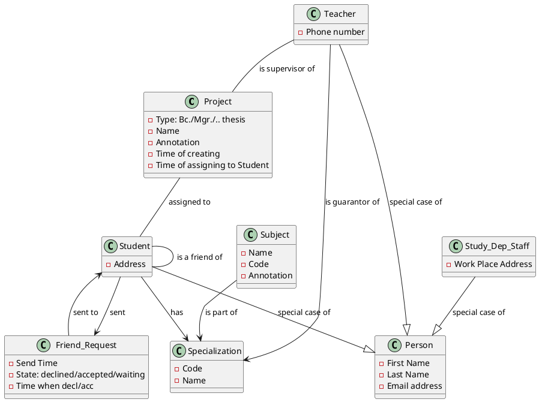

## Domain model
In context of information we store and work with.

```plantuml
@startuml
class Project 
{
- Type: Bc./Mgr./.. thesis
- Name
- Annotation
- Time of creating
- Time of assigning to Student
}
class Student 
{
- Address
}
class Teacher 
{
- Phone number
}
class Specialization 
{
- Code
- Name
}
class Subject 
{
- Name
- Code
- Annotation
}
class Person 
{
- First Name
- Last Name
- Email address
}
class Study_Dep_Staff 
{
- Work Place Address
}
class Friend_Request 
{
- Send Time
- State: declined/accepted/waiting
- Time when decl/acc
}
Student -- Student : is a friend of
Student --|> Person : special case of
Teacher --|> Person : special case of
Study_Dep_Staff --|> Person : special case of
Teacher --> Specialization : is guarantor of
Student --> Specialization : has
Subject --> Specialization : is part of
Student --> Friend_Request : sent
Friend_Request --> Student : sent to
Teacher -- Project: is supervisor of
Project -- Student : assigned to
@enduml
```

