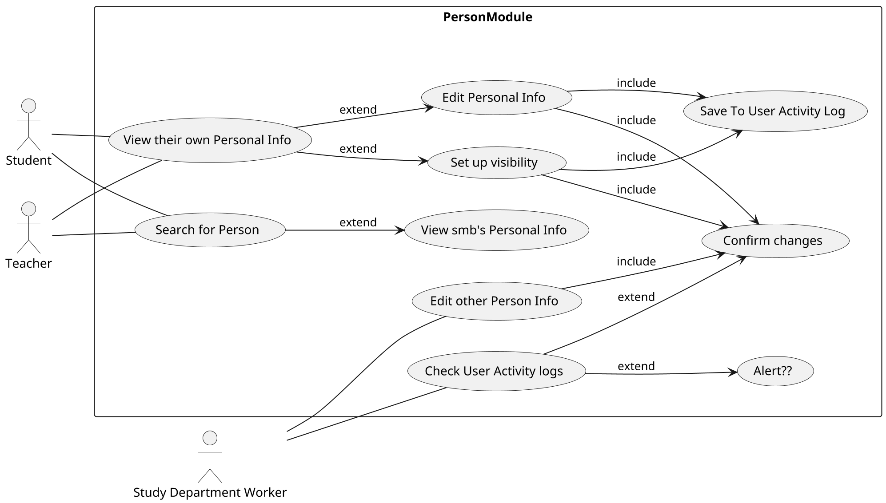
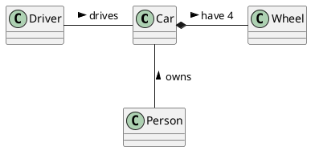

# Student information system - Person module

[*Module description*]

## Functional Requirements

This section specifies the functional requirements.

### User requirements

[*List of user requirements in a form of user stories*]

### System requirements

#### Actors

- Teacher: Person, that teaches courses, supervise thesis, ... 
- Student: Person, that studies at university
- Study Department staff: Person, that works at Study Departmant. Manages administartive smth ...

#### Use cases
##### 1. Use cases for user stories 1, 2, 3, 4, 6, 8 (prototype)

[*Use case diagram in PlantUML*]

[*Describe the diagram in a short paragraph. Describe each use case from the diagram in the detail from the lecture in a separate subsection.*]

###### [*Use case title*]

[*Use case description in the structure from the lecture.*]

[*Add an activity diagram for one use case per a team member*]

## Information model

[*Express the information model of the domain as a UML class diagram in PlantUML. Do not use class methods in the diagram, only classes, class attributes and associations connecting classes.*]

[*Document each class with in a separate subsection*]

### [*Class name*]

[*Class description consisting of its definition, description of its essential properties (attribues and associations).*]
