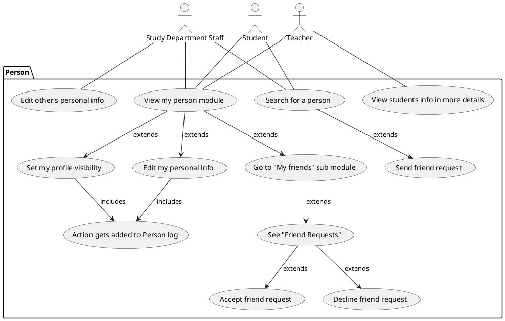

## Use cases UML diagram
Use cases from issues.

```plantuml
@startuml
actor :Study Department Staff: as dep
actor Student as s
actor Teacher as t
package Person {
 usecase "View my person module" as vp
 usecase "Edit my personal info" as ed
 usecase "Set my profile visibility" as sv
 usecase "Action gets added to Person log" as pl
 usecase "Send friend request" as sf
 usecase "Accept friend request" as af
 usecase "Decline friend request" as df
 usecase "Search for a person" as sp
 usecase "View students info in more details" as vs
 usecase "Edit other's personal info" as oo
 usecase "Go to "My friends" sub module" as gf
 usecase "See "Friend Requests"" as fr
}

t -- vs
t -- sp
s -- sp
dep -- sp
sp --> sf : extends
t -- vp
s -- vp 
dep -- vp
vp --> sv : extends
vp --> ed : extends
sv --> pl : includes
ed --> pl : includes
dep -- oo
vp --> gf : extends
gf --> fr : extends
fr --> af : extends
fr --> df : extends

@enduml
```
### 2nd version

### 1st version

